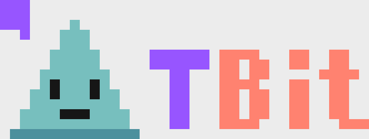

# Reto 1 — $1 de pixeles: logo TBit en el centro del canvas

**Entrega: una sola compra de 183 pixeles por $0.915** (≤ $1.00), todos a precio base $0.005.

- **buyId:** `01KWQFYBJPYT874E5GQ0MY172G`
- **Preview:** https://www.frontpage.sh/million/preview?id=14EbcZDBvp3s
- **Ubicación:** rect (482,448)–(518,461) — a ~45 px del centro exacto (500,500) del canvas
- **Link:** los 183 pixeles son clickeables → https://t-bit.io (label "TBit" al hover)

## Cómo se hizo (uso inteligente del presupuesto)

1. **Análisis gratis antes de gastar** — `place.py` baja el grid completo (`GET /api/million/grid`, gratis) y busca rectángulos 100% vírgenes cerca del centro: visibilidad de zona cara a precio base.
2. **Redibujo manual, no resize** — a 37×14 un JPG encogido se vuelve ruido; `build_art.py` redibuja el logo a mano: paleta de 5 colores planos muestreados del original, mascota con carita legible, globo de diálogo y wordmark "TBit".
3. **El fondo trabaja gratis** — los blancos no se pintan; el fondo claro del canvas hace de blanco. Cada pixel pagado carga información.
4. **Compra quirúrgica** — quote gratuito valida el total exacto, un solo `buy` vía MPP liquidó 183/183 pixeles (lostCount 0).
5. **Bonus** — el arte es también un anuncio funcional: hover → "TBit", click → t-bit.io. Y `monitor.py` vigila el grid cada 30s por si alguien pisa el logo.

## Archivos

- `build_art.py` — genera `pixels.json` (arte) y `preview.png`
- `place.py W H [margen]` — encuentra rects vírgenes cerca del centro con grid fresco
- `monitor.py` — monitorea el canvas cada 30s (vendidos, deltas, integridad de rects)
- `quote.json` — el quote real de la compra entregada
