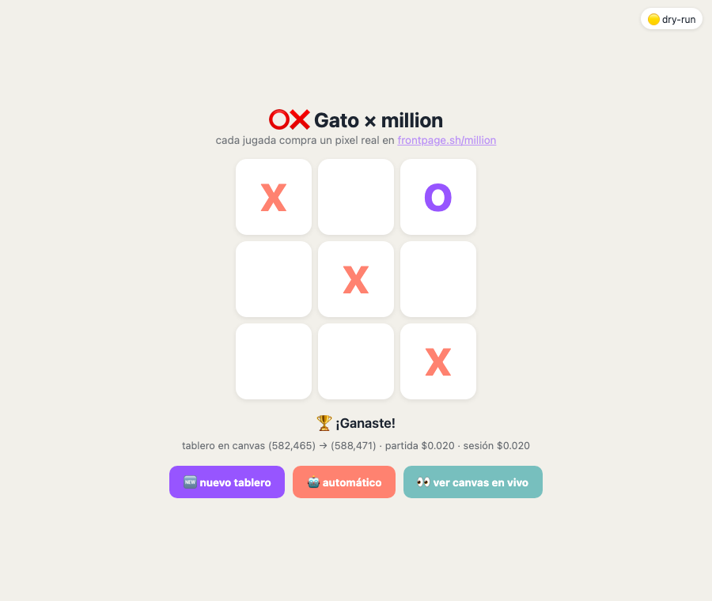

# Reto 2 — ⭕❌ Gato en el canvas

Tic-tac-toe donde **cada jugada compra un pixel real** en frontpage.sh/million (USDC en Tempo vía MPP).



## Diseño con la economía en mente

- En el gato una casilla jugada **nunca se reescribe** → máximo 9 compras por partida.
- **Tablero nuevo por partida**: se auto-coloca en 9 pixeles vírgenes ($0.005 c/u) → partida completa ≤ **$0.045**.
- **Vacío = pixel sin comprar**: el fondo del canvas es el tercer color, gratis.
- El **estado se lee siempre del canvas** (`GET /api/million/pixel`), nunca de memoria local — si un tercero compra una casilla a mitad de partida, aparece como `?` (casilla robada).
- X = coral `#ff8270` · O = morado `#9755ff` (paleta TBit); casillas espaciadas 3px para verse de lejos.

## Interfaz web (demo)

```bash
python3 server.py            # dry-run: lee el canvas real, simula compras
python3 server.py --live     # compras reales vía mppx
```

→ abre **http://localhost:8787**

- Click en una casilla = juegas X (compra el pixel) y el **bot minimax imbatible** responde con O.
- **🤖 automático**: la IA juega sola las dos fichas, un pixel a la vez, y lo ves pintarse en el canvas en vivo.
- **🆕 nuevo tablero**: arma otra partida en 9 pixeles vírgenes nuevos.
- Detección automática de ganador/empate; contador de gasto por partida y por sesión.

## CLI

```bash
python3 gato.py              # dry-run
python3 gato.py --live       # compras reales
```

Mismo motor: tablero coloreado ANSI, humano X vs bot minimax O, retry con backoff ante rate-limits (429) del API.
